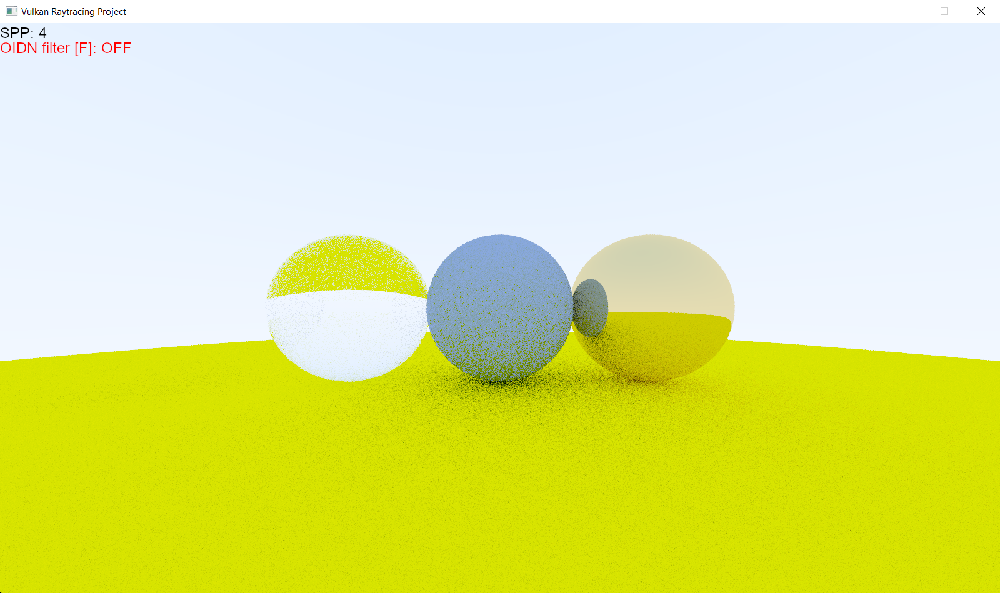
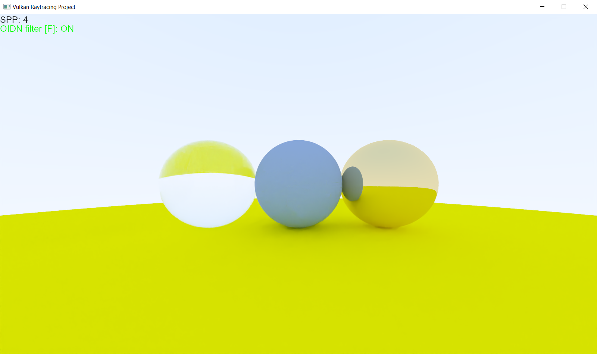

# Vulkan Raytracing Project
A real-time raytracing program in Vulkan. This program uses compute shaders to compute the raytraced pixels and optionally uses Intel's Open Image Denoiser to denoise the raytraced image.

## Gallery

##### Rendering without OIDN

##### Rendering with OIDN

## Build
### Windows Build
##### Prerequisites:
- CMake <=3.10
- [LunarG Vulkan SDK](https://vulkan.lunarg.com/sdk/home#windows)
- Visual Studio

##### Build Instructions

> Note: you can do step 2 to 7 on the command line if cmake is added to the PATH environment variable. Just run `cmake -G <Visual Studio Generator> -DPLATFORM="Windows" ../` inside the `build` folder.

1. Create a `build` folder inside the project root directory
2. Open the CMake GUI
3. Clear the CMake cache (File -> Delete Cache)
4. Specify the source directory to be the project root directory
5. Specify the build directory to be the `build` folder inside the project root directory
6. Add an entry of type `STRING` with `PLATFORM` as the name and `Windows` as the value
7. Click on `Configure` then `Generate`. It should generate `VulkanRaytracing.sln` inside the `build` folder.
8. Close CMake and open `VulkanRaytracing.sln` with Visual Studio.
9. Click on the VulkanRaytracing solution in Solution Explorer
10. Select the build (e.g. Debug x64 or Release x64)
11. Click on `Build -> Build VulkanRaytracing`
12. Copy the executable from the output folder to the project root directory
13. Copy all the DLLs from `lib/windows/DLLs/` to the project root directory
14. Run the executable in the project root directory

### Linux x86_64 Build
##### Prerequisites
- CMake <=3.10
- GNU make <=4.2
- [LunarG Vulkan SDK](https://vulkan.lunarg.com/sdk/home#linux)
- OpenGL headers
    - Install from the package `mesa-common-dev`
- GLFW3
    - Install from the packages `libglfw3` `libglfw3-dev`

##### Build Instructions
1. Go to project root directory
2. `mkdir build && cd build`
3. `cmake -DPLATFORM="Linux_x86_64" ../`
4. `make`
5. `cp VulkanRaytracing ../`
6. Run the executable in the project root directory